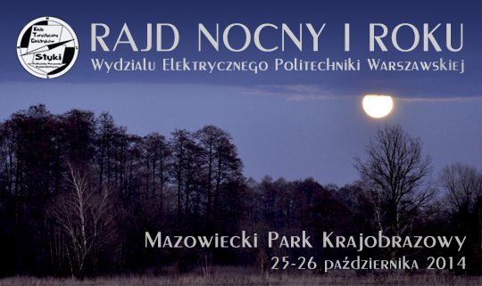

Rajd Nocny
==========

tradycyjny coroczny Rajd Nocny organizowany przez KTE Styki

podstawowe informacje
---------------------

* kierownik imprezy:
	* Maciej Płoński
	* mail: info (małpa) sokoli.pl
	* telefon: 604 069 760

zapewnione atrakcje
-------------------

* przemarsz po Mazowieckim Parku Krajobrazowym (częściowo w nocy)
* ognisko z kiełbaskami w tajemniczym miejscu
* śpiewanki turystyczne
* nocleg w warunkach turystycznych w szkole
* troskliwa opieka kierownika

wyjazd
------

* wyjazd:
	* odjazd: 25/10/2014, 10:39
	* **zbiórka** 25/10/2014 10:20 na peronie dworca Warszawa Śródmieście (na wysokości kas)
	* transport: Koleje Mazowieckie
	* koniec: tajemnica!
	* **bilety każdy kupuje samodzielnie** - wkrótce informacja o stacji końcowej (do końca tygodnia roboczego)

* powrót:
	* odjazd: 26/10/2014, 12:01
	* transport: Koleje Mazowieckie
	* start: Celestynów
	* **bilety każdy kupuje samodzielnie**

trasa
-----

* trasa jest jeszcze owiana tajemnicą.
* kolejne jej punkty też są owiane tajemnicą.
* powiem jedynie, że nie będzie długa.
* no dobra, powiem, że będzie ognisko w Centrum Edukacji Leśnej (CEL) niedaleko Celestynowa (ich wiata).
* a, nocleg w szkole w Regucie.
* dystans - mały - do ogniska (CEL) będzie do około 15km, a po ognisku przejście na nocleg wynisie około 5-6km.

trasa dla dzieci
----------------

planowana jest także trasa dla dzieci. szczegóły wkrótce.

koszta
------

* bilet na pociąg - ok 12zł na osobę dorosłą w jedną stronę. (jak ktoś ma zniżki to taniej!)
* opłata za udział w ześrodkowaniu na ognisku - 15zł. (opłata od każdej osoby biorącej udział w ognisku, niezależnie od tego czy bierze udział w pozostałej części imprezy)
* opłata noclegowa - 10zł
* wyżywienie / inne - indywidualnie.

łącznie: 49zł dla osób dorosłych + wyżywienie własne.

nie jest przewidziane zwiedzanie płatnych obiektów - nie ma takich po drodze :)

każdy uczestnik bierze udział na własną odpowiedzialność - warto mieć ubezpieczenie.

wyposażenie
-----------

na trasę:

* **wyżywienie** na trasę dnia pierwszego. i obiad dnia pierwszego. i ognisko (kiełbaski! chleb!). i kolację pewnie. i śniadanie w niedzielę.
* słodycze i inne atrakcje do zwiększenia grupowego szczęścia
* termos z herbatą i woda w butelce (i zapas herbaty na kolację / niedzielę)
* mapa rejonu oraz kompas (jeśli ktoś chce)
* **(ważne)** latarka (zalecane: czołówka + zapasowa) i zapas baterii (część trasy odbywa się w nocy)
* zestaw bluza + kurtka przeciwdeszczowa na złą pogodę
* wygodne buty i dobry plecak :)

na nocleg:
* kapcie na zmianę
* karimata, śpiwór

chcę jechać, co robić?
----------------------

* powiadomić kierownika mailem lub telefonicznie
* kupić bilet na pociąg
* stawić się na miejscu zbiórki

z uwagi na wielkość miejsca noclegowego - liczba miejsc może być ograniczona.

inne uwagi
----------

można zerknąć na moją prywatną [listę sprzętu](/sprzet) - niby warunki mają być letnie, ale lepiej być przygotowanym na załamanie pogody.

